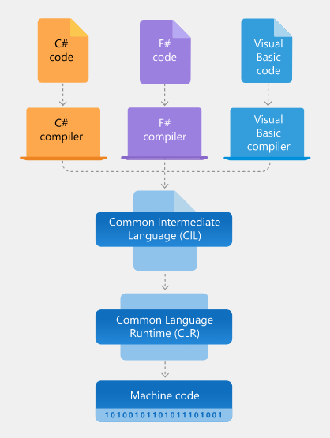

[TOC]

# C#은 이런 것입니다.

C#은 "씨샾"이라고 읽으면 됩니다.

C#의 가장 중요한 특징은 두 가지 입니다.

1. C#은 형식이 안전한 최신 **객체 지향 프로그래밍 언어**입니다.

2. C#은 **.NET 런타임을 위해** 특별히 **제작된 언어**입니다.

   

  C#은 그 외에도 가비지 수집, Nullable 형식, 예외 처리, 람다 식, LINQ, 통합 형식 시스템, 비동기 코드 등 지속형 프로그램을 만드는데 도움이 되는 다양한 기능을 제공합니다. 자세한 내용들은 차근차근 소개하고, 본 장에서는 가장 큰 두 가지 특징에 대해서 먼저 알아보겠습니다.

# .NET Framework 구조

  C#을 배우면  .NET 시스템에서 실행되는 다양한 형식의 프로그램을 개발할 수 있습니다. 마이크로 소프트에서는 .NET Framework에 대해 다음과 같이 설명하고 있습니다.

***"C# 프로그램은 <u>CLR(공용 언어 런타임)</u>이라 불리는 가상 실행 시스템이며, <u>클래스 라이브러리 세트</u>인 .NET에서 실행됩니다."***

  처음 보는 개념이 두 가지 등장합니다. 'CLR(공용 언어 런타임)'과 '클래스 라이브러리 세트' 인데요, 먼저 CLR에 대해서 알아보도록 하겠습니다.

## CLR(공용 언어 런타임)

  CLR(공용 언어 런타임)은 .NET Framework의 기초로써,  우리가 일반적으로 프로그램을 작성할 때 신경써야 할 메모리관리, 스레드 관리, 오류 처리 등의 작업을 도와 프로그래밍을 단순하게 만들어줍니다. 

<b><.NET Framework Architecture></b>

*출처 : https://dotnet.microsoft.com/learn/dotnet/what-is-dotnet-framework

  위의 그림에서 보이는 바와 같이 .NET 응용 프로그램은 C#, F#, Visual Basic 언어로 작성되고, 작성된 언어에 구애받지 않는 CIL (Common Intermediate Language)로 컴파일되어 .dll 혹은 .exe 파일(어셈블리)로 저장이 됩니다.  그리고  프로그램이 실행 될 때, CLR은 저장된 어셈블리를 가져와 JIT (Just-In-Time 컴파일러)를 사용하여 실행중인 컴퓨터의 특정 아키텍처에서 실행할 수있는 기계어 코드로 변환하고, 프로그램이 작동하게 됩니다. 

*"이러한 구조는 다양한 프로그래밍 언어를 사용하여, 다양한 OS에서 실행 가능한 프로그램을 만드는 토대가 됩니다."*

## .NET Framework 클래스 라이브러리

  클래스 라이브러리는 .NET Framework를 사용하는 모든 언어가 사용할 수 있는 클래스들의 집합입니다. 클래스 라이브러리에는 파일 읽기 및 쓰기, 데이터베이스 연결, 그리기 등을위한 API가 포함되어 있습니다.  클래스 라이브러리들은 계층 구조를 구분할 때 점(.)을 이용합니다. 아래의 그림은 다양한 클래스 라이브러리들의 예시입니다.

*"개발자는 사전에 잘 구현된 클래스 라이브러리들을 활용하여 빠르고 간편하게 다양한 기능들을 구현할 수 있습니다."*

<b><.NET Class Library></b>

# 객체 지향 프로그래밍

  객체 지향 프로그래밍이란 프로그램을 '객체(Object)'라는 기본 단위와 객체간의 상호작용을 기반으로 프로그램을 서술하는 방식입니다.